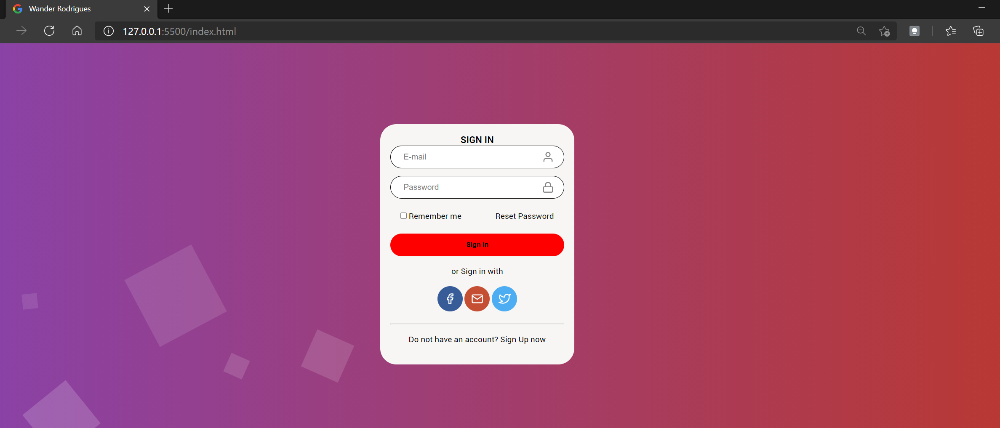

## 🚀 Tecnologias

Esse projeto foi desenvolvido com as seguintes tecnologias:

- HTML
- CSS

## 💻 Projeto
 Esse projeto foi desvenvolvido para praticar conhecimentos sobre as tecnologias citadas acima.

  

## :memo: Licença

Esse projeto está sob a licença MIT. Veja o arquivo [LICENSE](LICENSE.md) para mais detalhes.

## Authors
* [**Wander27Rodrigues**](https://happy-shirley-6b48b1.netlify.app/)
